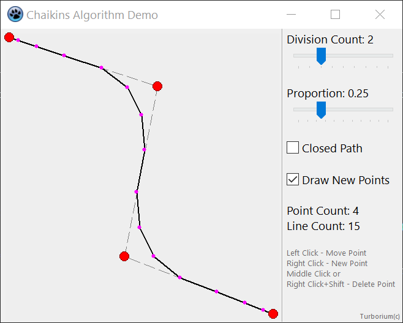
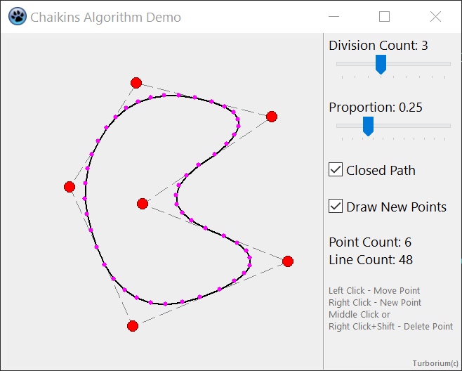
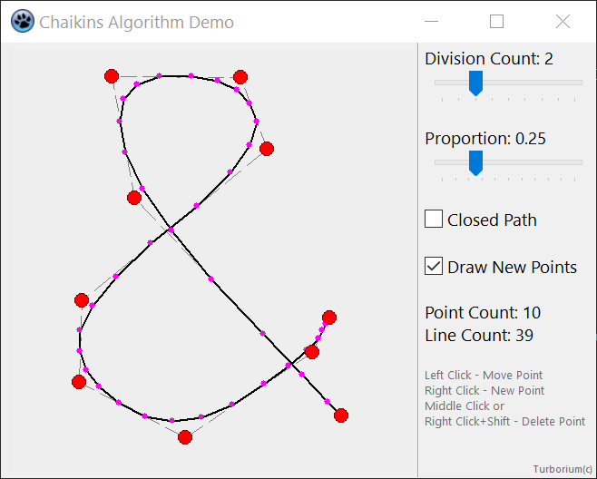
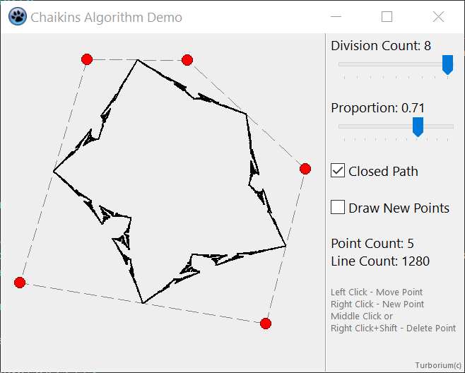

# ChaikinsAlgorithmExplorer

[Powered By Lazarus (ObjectPascal)](https://www.lazarus-ide.org/)  

Application for learning the [Chaikins Algorithm](https://www.cs.unc.edu/~dm/UNC/COMP258/LECTURES/Chaikins-Algorithm.pdf).  
  
See also: [ChaikinSmoothEffect](https://github.com/turborium/ChaikinSmoothEffect) and [chaikinSmoothGo](https://github.com/turborium/chaikinSmoothGo)
  

